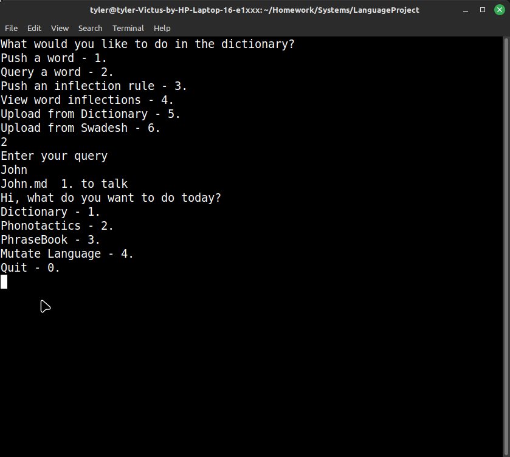
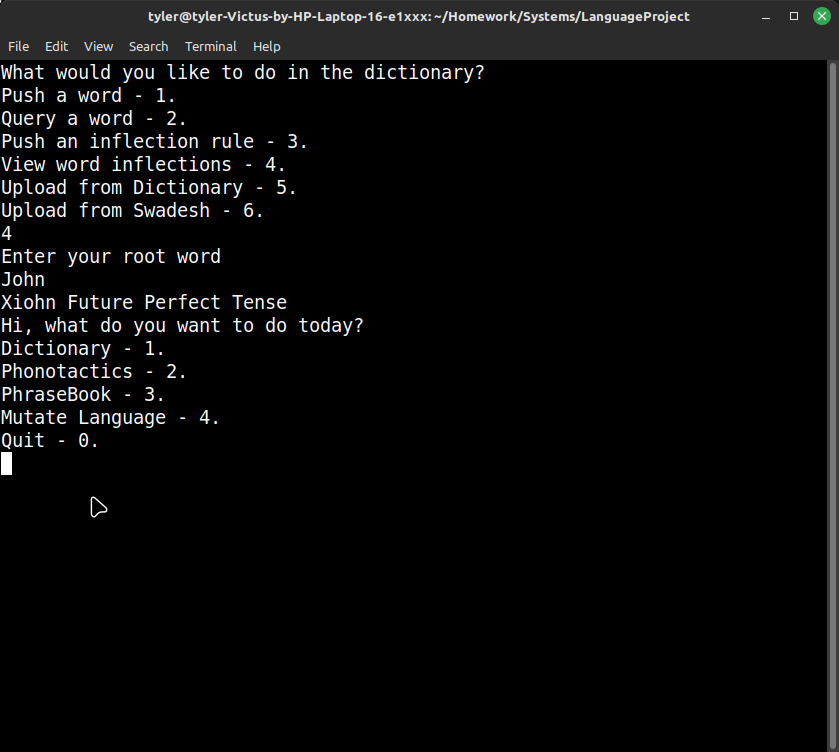
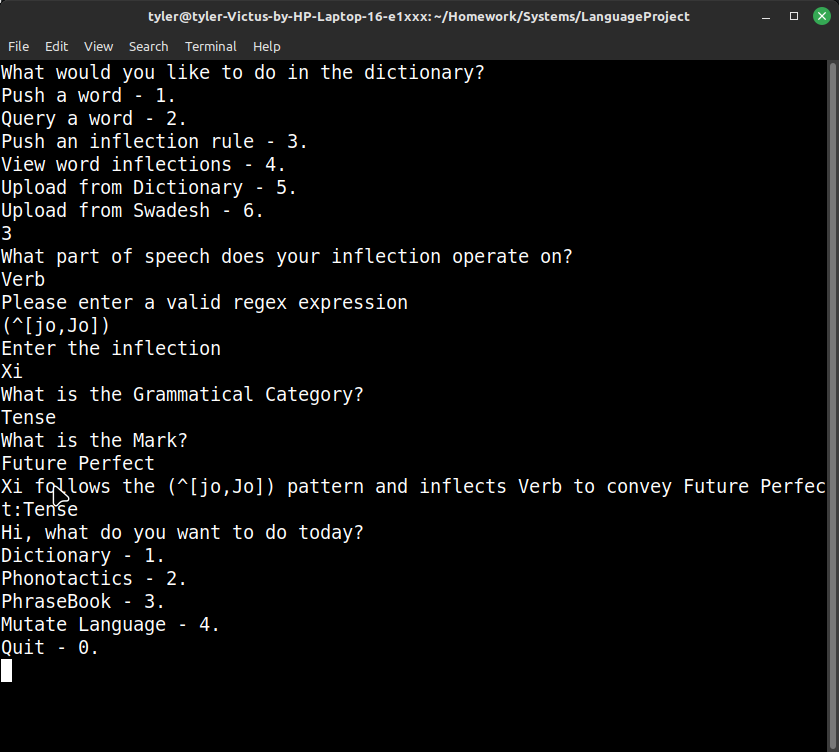
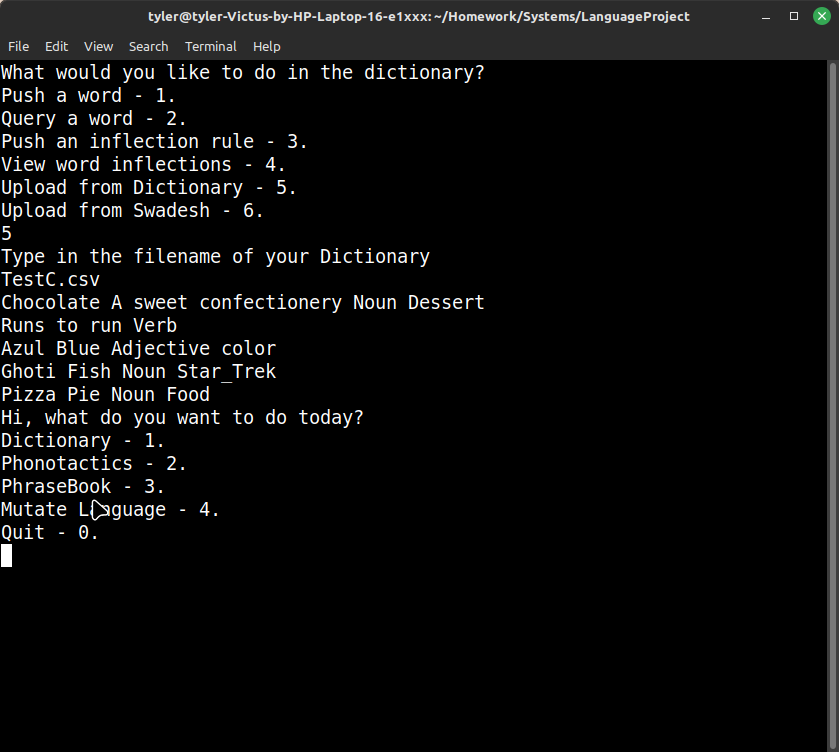
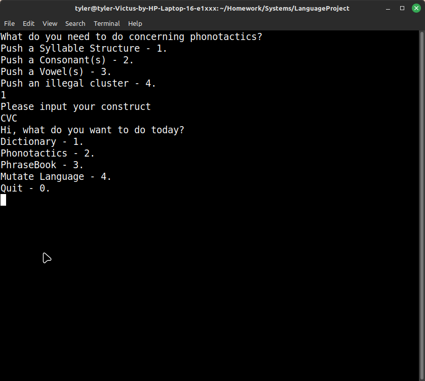
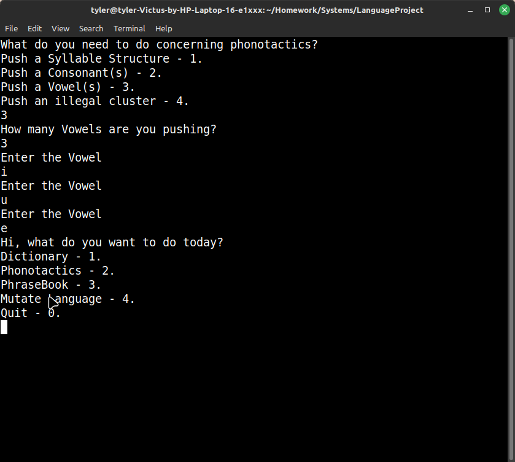
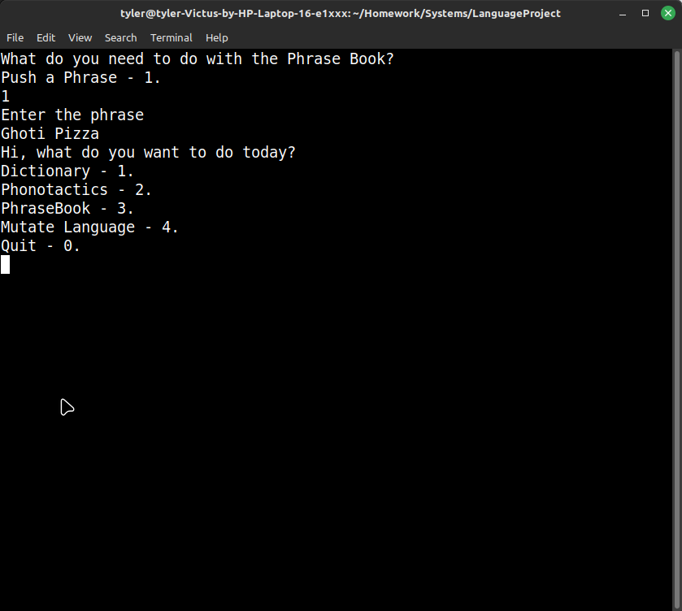
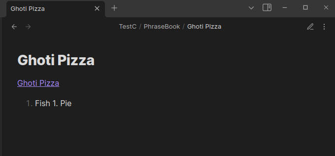

# Conlang Script Suite
## Author: Tyler Van Buren
## Class: CSIT 231
## Professor: Zhu

## About
This a project for the automation of creating constructed human languages using a suite of bash scripts. The primary purpose of this project is to meet grade milestone for CSIT-231. The secondary purpose of this project is to hit specific milestones in functionality of the suite.

## Rubric Milestones
* Condition Statement
* Loop
* Positional Parameters
* File I/0
* Functions with Parameters
* Use comments

## Functionality Milestones
* The capacity to define inflectional rules using regex
    * Status: 100%
* The ability to push words to a dictionary(database of markdown files) either from a file or user input
    * Status: 100%
* ~~Generating a dictionary of inflected variants from the root words~~
    ~~* Status 50%:~~
    * Decided to axe this before submission as I don't have much use for it right now. Just displaying the permutations as they're called is sufficient funcitionality for the time being
* The ability to assign phonotactic rules such as illegal clusters and ellisions
    * Status: 100%
* The capacity to mass mutate a language with regex. eg. Vowel shifting A->e or dropping vowels in certain clusters, with the intended effect of creating new dialects or descendant languages.
    * Status: 100%
* The ability to generate new words from user defined ~~CFG~~ Rules
    * Status 100%

# How to use
./interface.sh will summon an interface for using the script suite
When you are prompted for a language, the script will automatically create folder directories for you if the language doesn't exist.

# Specific Functions
---
## Dictionary
---
### Push a word
This pushes a user defined word to the dictionary as a markdown file.

### Query a word
This returns a word and its definition based on user search

### View word inflections
This will inflect a given word, so long as it exists in the dictionary and has appropriate tags to guide inflection rules.
	

### Push Inflection rules
Grabs a RegEx expression from the user and a replacement string to be applied to words with a specific tags.

### Push from Dictionary
Populates the language from a tab delimited dictionary file where
*The first tab is the word
*The second is the definition
*Finally the third is the array of tags

### Push from Swadesh
Populates the language by randomly generating words and matching them to premade definitions from a tsv.

**==You should probably head to the next section and populate some construction rules before doing this.==**
---
## Phonotactics
---

### Push a Syllable Structure
Pushes a Vowel Consonant structure

### Push a Consonant
Pushes valid consonants for word generation

### Push a Vowel
Pushes valid vowels for word generation

### Push an Illegal clusters
Pushes Illegal clusters to be ellided during word generation(//elliding of illegal clusters not yet implemented)

---
## Phrasebook
---
### Push a Phrase
This pushes a phrase as a markdown file to a folder containing all of the languages phrases. If the words are in the dictionary, they will be hyperlinked to their dictionary file.

---
## Mutate
---
Mutates a language by replacing a specific sequence of characters with another sequence, both provided by the user
